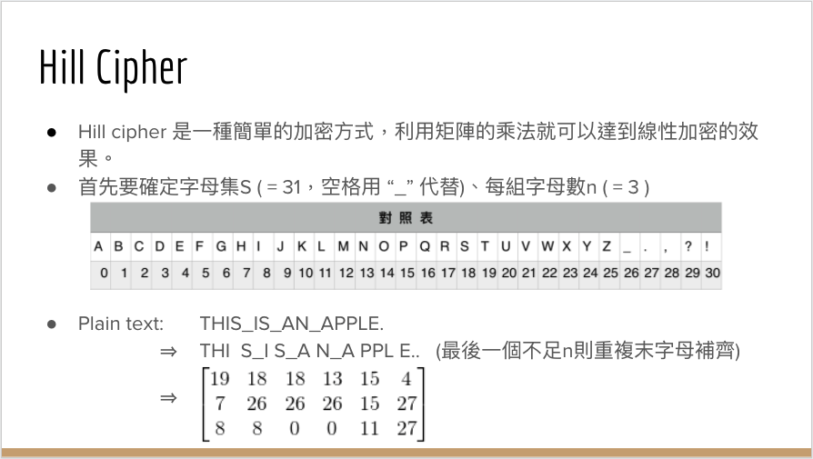
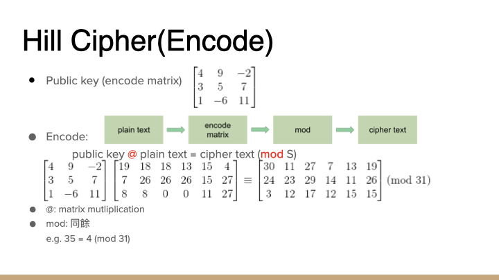
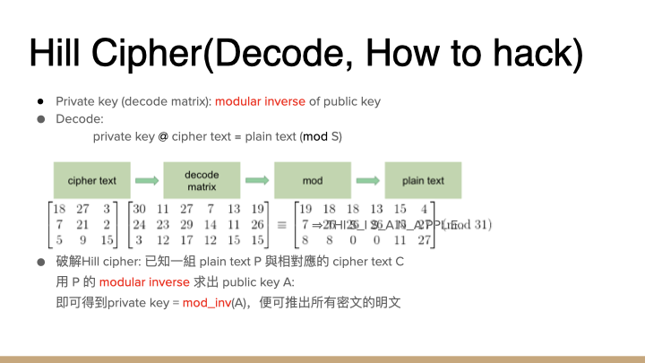

# Homework 2: Hill Cipher

## Purpose:

Decode the cipher text and find the secret key by linear algebra invertibility and multiplication.

## Summary:
Hill Cipher is a simple encryption method by using linear multiplication. It takes a string as an input and output a string of cipher with a public key.

**To Encrypt the plain text:**
1. Replace the space( ) with underscore(_), and map each character with character map to number
2. Replicate the last character to multiple of 3
3. Reshape the numbers to 2-D array with 3 rows
4. Multiply the 2-D array with public key to get a 2-D array
5. Reshape 2-D array to 1-D array and use character map transform to cipher text

**To Decript the cipher text:**
1. Map each character with character map to number
2. Reshape the numbers to 2-D array with 3 rows
3. Multiply the 2-D array with private key to get a 2-D array
4. Reshape 2-D array to 1-D array and use character map transform to plain text
5. Replace the underscore(_) with space(_), and eliminate duplicated character at the end
### Problem 1
**What is the plain text with following info?** 
cipher: C!QER,YNR  
public key: 25 8 25 9 9 16 28 21 18  

### Explanation
  1. Cipher text is calculated by multiplying the public key with plain text (Fig. 1), and plain text is calculated by multiplying the private key with cipher text (Fig. 2)
  2. Now we need private key to get plain text. Multiply modular inverse of public key on leftside in Fig. 1 equation would equal to Fig. 2 equation, therefore private key is the modular inverse of public key.
  3. Multiply secret key with cipher text, then the plain text would be founded

**Solution: IS_THAT_W**

### Problem 2
**1. What is the public key with following info?**  
cipher: C!QER,YNR  
plain: IS_THAT_W  

### Explanation
  1. Now we have cipher and plain text. Multiply modular inverse of plain text on rightside in Fig. 1 equation, then we can get the public key.
  2. Multiply cipher text with modular inverse of plain text, then the public key would be founded

**Solution: 25 8 25 9 9 16 28 21 18**

**2. What is the plain text with following info?**  
*cipher: QYDPCSCFI*  

### Explanation

It's same as 1st problem, use public key and cipher text to get plain text  
**Solution: DUDE_,_YO**
## Reference

- [Homework explaination powerpoint](https://docs.google.com/presentation/d/1I0PlIn2Ak3rzvm3d8fFN1yuVb76frMa_YNxSuyzq_zI/edit#slide=id.ga3d83a1657_0_23)
- [Homework explaination video](https://drive.google.com/file/d/18NQ2CP7iCcbGTztOnYMycm5Y0Z8IWa1j/view)