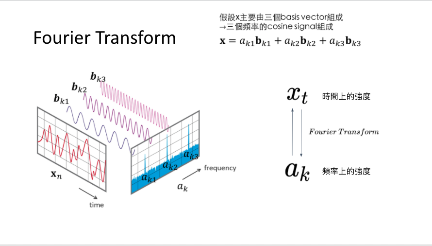
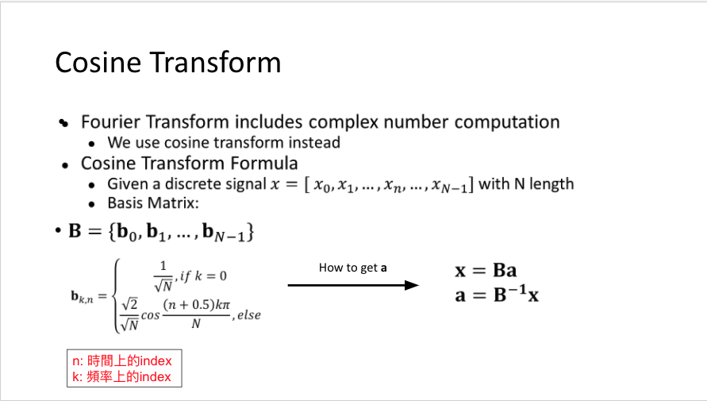

# Homework 3: Cosine Transform

## Purpose:

Cosine Transform the signal to frequency domain by using linear algebra transformation.

## Summary:

A periodic signal can be represented as a sum of sinusoids, Cosine Transformation can represent a signal in frequency domain similar to Fourier Transform. It takes a time series signal as an input and output a frequency series spectrum. It's useful for filtering unwanted frequency like noise. 

**Cosine Transform the signal vecter set:**
1. Calculate the basis of Cosine Transformation matrix by formula
2. Inverse the Cosine Transformation matrix
3. Multiply the inverse matrix on signal vector set

**Transform the frequency spectrum to time series signal:**
1. Multiply Cosine Transformation matrix on cosine domain coefficient vector
   
### Problem 1
**Given specified input, calculate the coefficient of cosine frequency domain** 
Follow the steps of Cosine Transformation.

### Problem 2
**Draw the filtered signal with highest 5 frequency** 

  1. Cosine Transform the input to frequency domain
  2. Find the highest 5 by np.argsort(). 
  3. Mask other signal by mask
  4. Transform the frequency spectrum to time series signal by multiply them with Cosine Transformation matrix.

## Reference

- [Homework explaination powerpoint](https://docs.google.com/presentation/d/1iYvHbSVFE4SBK6a8ZgYvmnEmdQiGNUq2F13J63Rq7Gw/edit#slide=id.g6f6f22eb08_0_14)
- [Homework explaination video](https://drive.google.com/file/d/1NFr3S2xim0G9Y9_-m8_Rl_t31jw4lHrb/view)