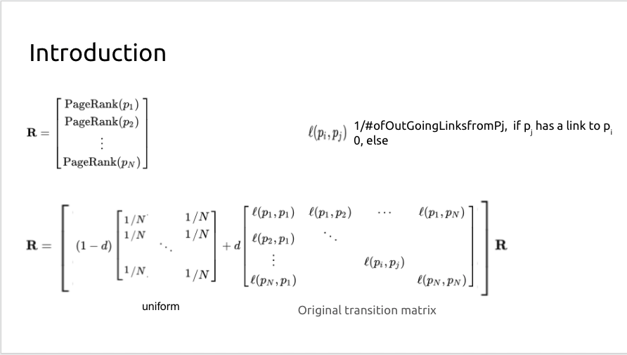

# Homework 4: PageRank

## Purpose:

PageRank is an algorithm to measure the importance of a website by using Power method.

## Summary:

To calculate the page rank, we start with multiplying a random input to a matrix. The matrix is composed with two element, a uniform matrix and original transition matrix. The uniform matrix represents a user may randomly browse the webpage across the internet, and original transition matrix represents a user browses the page depending on the outgoing link from p$_{j}$ to p $_{i}$ as the diagram illustrates.

Each page's outgoing link should divide by its total link number, for example, a node with 5 outgoing link would have 5 outgoing element with value 1/5.

### Problem

**You will get a 2-dimensional list describing the topology of a network, output the correct ordering of each page.** 

1. Draw the transition matrix and uniform matrix
2. Set d equals to 0.85 and initialize the Page Rank with N elements [1/N 1/N ...]
3. Iteratively calculated the Page Rank until converge, which means new Page Rank nearly equals to original Page Rank

## Reference

- [Homework explaination powerpoint](https://docs.google.com/presentation/d/1vbYek4gRBN617nJ5J94RV8hs8sGClzst/edit?fbclid=IwAR08oQwJOyEFUZuXo-8YNAGh_5A4oHMYSICPdQEDsJ1QAnLsqeOtLBxq0SQ#slide=id.gaf084a5ff4_0_0)
- [Power Method Wiki (Python solution included)](https://en.wikipedia.org/wiki/PageRank)
