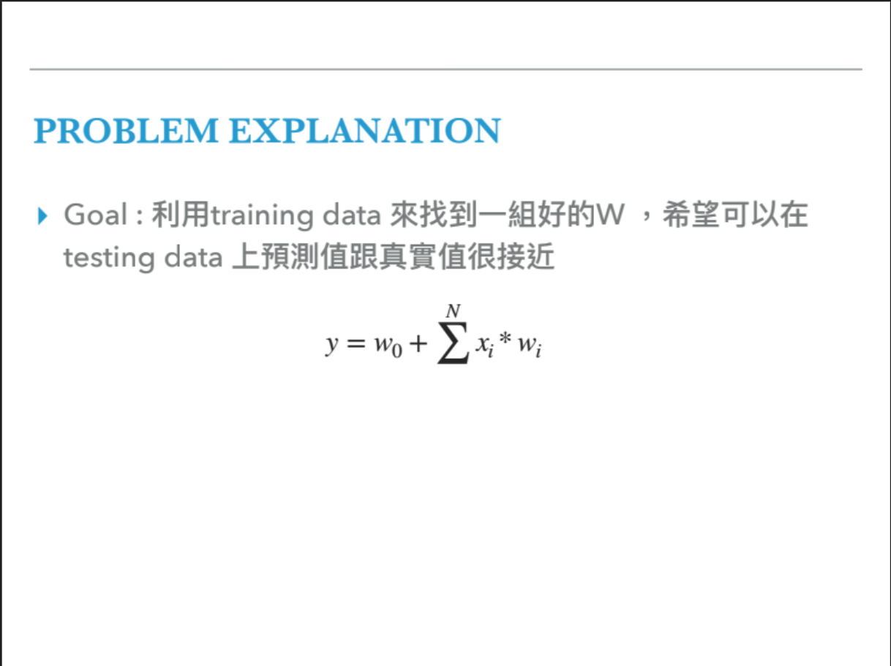
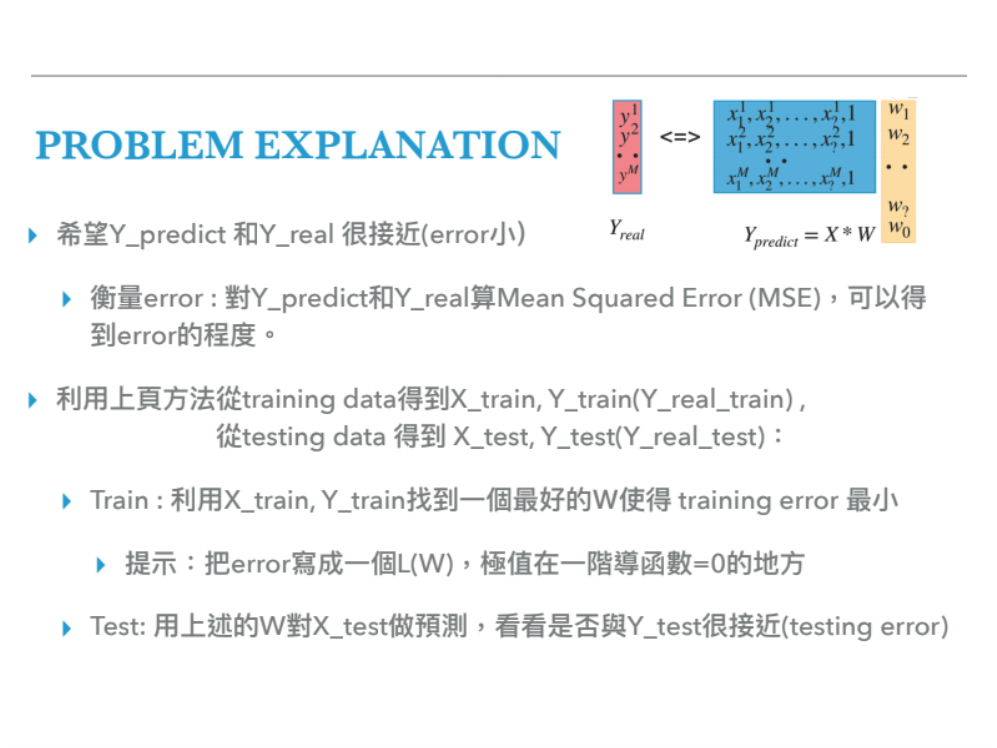
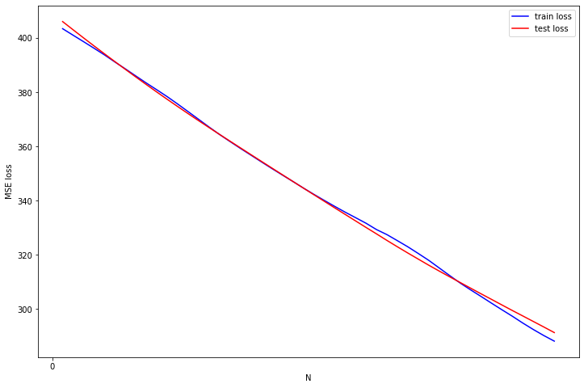

# Homework 5: Linear Regression

## Purpose:

We want to use linear regression to predict the PM2.5 index in the following hour.

## Summary:

Given a lot of datapoints in a 2 dimentional space, we can find a best function to describe the prediction at each moment by using Linear Regression.

**Problem Explanation:**

Assume we have N features to predict the outcome, then then N weights are applied on the feature plus a constant number to predict the outcome. So this task aims to get these weights and the constant.

**How to measure our performance?**
The task uses Mean Squared Error(MSE) to calculate the error, basically it takes all the squared distance from predicted y subtracting real y and take the mean.

**How to update the weight**

We have to update the weight based on the first derivative function of Loss function, denoted as L(w). The derivative function of L(w) is called gradient which indicates the slope in the solution domain, if gradient is close to 0 means it’s close to solution. Thus, We take negative direction of the slope to find the global minimum solution. The old weight would be updated based on alpha times gradient.

### Problem 1

**Complete the TODO part in the Linear Regression class** 

First we calculate the gradient, and then update the old weight with alpha times gradient. Alpha means the learning rate as a constant to update the weight.

### Problem 2

**Plot the training and testing error N from 1 to 48**

N indicates how many hours to include in your features, N equals to 1 means only use 1 hour to predict PM2.5 in the next our. N equals to 48 means include 48 hours to predict the next hour. The graph shows that with learning rate keeping in 10−7 getting a pretty result at the N with 20. Ideally, if we include more features, the prediction should be more reliable. But the graph shows that it’s a curve with high MSE loss on the two sides. The reason for it is that I think low N means not enough feature to get a good prediction, and high N means overfitting might occur.

### Problem 3

**Based on the experiment so far, give a complete method, result and observation in the report**

#### Change the learning rate to 10-6

If tune up the learning rate one order, the loss would increase with larger N, we will never find the optimistic point.

#### Change the learning rate to 10-8

However, if we tune down an order, the learning seems to be very slow.

#### Update the weight multiple times

We keep the N number with 20, and keep updating the weight, what would be the loss in the end? I train the Linear Regression model 1000 times with N equals 20. Training loss attain 53.45 and testing loss 55.53. Very excited!

#### Find out the lowest loss on training dataset

In the course, the professor had taught we can find the Pw projection function on the y vector. Then we can get the optimal function. By applying this weight to our training set, we can get the optimal MSE 26.53, and training set 26.20. So if we look back to our model, we still have room to improve. I think we have to add a momentum or gradually lower the learning rate would benefit. Look the figure surprise me there is still huge distance there.

- [Homework explaination powerpoint](https://drive.google.com/file/d/1NRMQInCh8kPKj9P6qsTINHCHaYolIihZ/view?fbclid=IwAR0GJGMKiMkWNJFQxYauZfnwedY7gNDScOz0K6wSQ6j13SJhi8AUUpofK2o)
