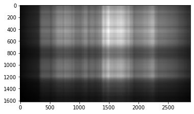

# Homework 6: Singular Value Decomposition

## Purpose:

Use Singular Value Decomposition to compress the image size.

## Summary:

Given any image, every image can be decomposed to U$\Sigma$V, and we can use SVD to compress image by use only part of the matrix to reconstruct the image.

### Problem 1

**A plot includes curve describing the relation of k and approxi- mation error** 

U and VT are orthogonal matrix, and Σ is diagonal matrix used as an index to enlarge/retract the vector. To reconstruct the image, we use matrix multiplication on U, VT and Σ. However, if we want to compress the image, we can only use part of the matrix. The Σ matrix from top left to right bottom represents the significance priority, we can take only one singular to construct matrix with U shape (2880, 1), Σ shape (1, 1) and VT shape (1, 1620), so on so forth.

This is the approximation and approximation error with only use one singular value.

This is the approximation and approximation with use 130 singular value.

  
  

  
   

  
   

  

Approximation Image with different k value 1, 5, 50, 150, 400, 1050, 1289

Approximation Error on k

### Problem 2

**Analyze the rank of R channel of the provided image and explain how you analyze**
The non-zero number of $\Sigma$ equals the rank of the image, which is 1680.

### Problem 3

**Plots in page 6 but on G channel(Ai,G, ∀1 ≤ i ≤ 5)**

  
  
  

  
  
  

Approximation Image with first k value 1, 2, 3, 4, 5 and summation of previous image.

## Reference

- [Homework explaination powerpoint](https://drive.google.com/file/d/1nJTnZWUXystt_GLBlcdjIcqjsMGTicdz/view?fbclid=IwAR2X-o_JTXNZpV2jIuWlcPPorwUZbWmYBMjPd1sn4Zrm_qCksBCM8PssMTA)
