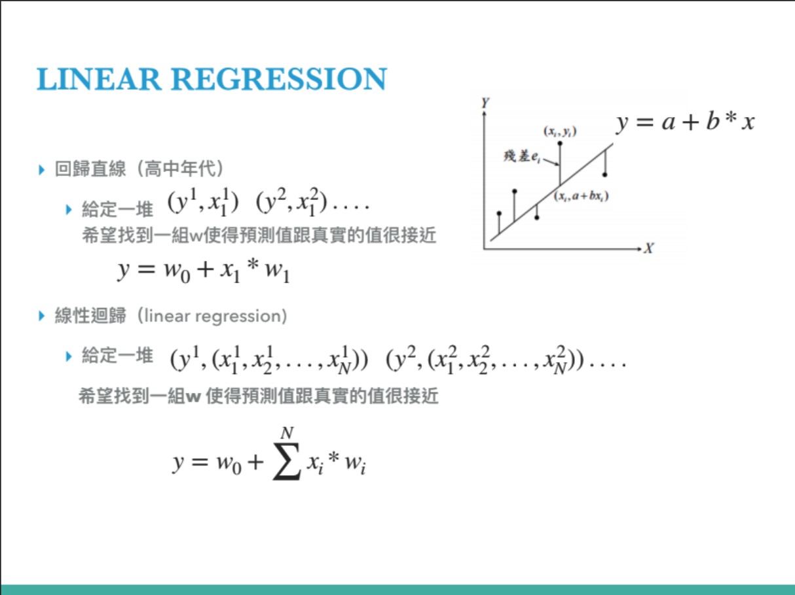
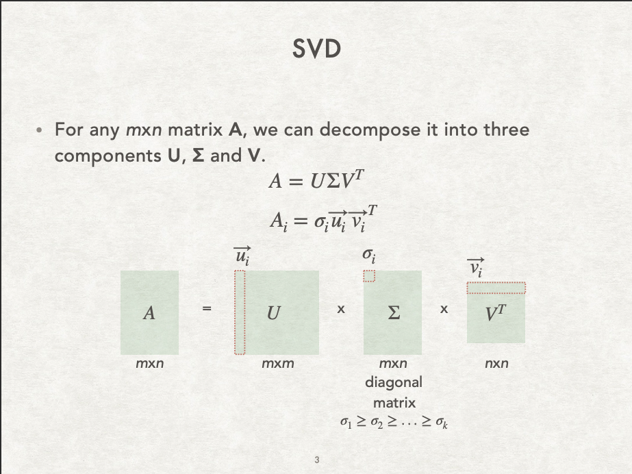

# Linear-Algebra

## HW1: Cycle Detection

Represent the graph as a matrix and use addition and multiplication to detect cycle.

## HW2: Hill Cipher

Transform the text in matrix, and use a encrypted matrix to encrypted the text by multiplication. Decode as the same way by using invert encrypted matrix.

## HW3: Cosine Transform

Build Cosine Transform matrix and use it to transform time domain signal to frequency domain. Then filter the signal to get the most significant 5 frequency.

## HW4: Page Rank

Use Power method to simulate how search engine rank the page of the website.

## HW5: Linear Regression

Given datapoints, try to find the function that best fit the datapoints with Least Squared Error.

## HW6: Singular Value Decomposition

Given an image, try to decompose the image with Singular Value Decomposition. Them compress the size of the image by using limited singular value.

